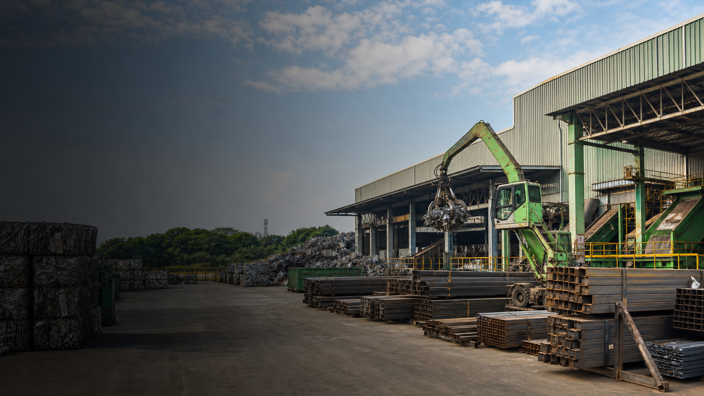

# Contact Us Page Wireframe

## Goal

Create a modern, corporate-industrial Contact Us page for Green Force that helps visitors quickly enquire, call, email, or navigate to the headquarter.

## Source Content

- Page heading: Contact Us
- Lead line: Get in touch with us
- Headquarter address: Setia Business Park II, No. 18, Jalan Perniagaan Setia 4, Taman Perniagaan Setia, 81100 Johor Bahru, Johor.
- Tel: 07-512 1389 / 07-595 2989 / 07-357 7333
- Fax: 07-512 2809
- Email: enquiry@greenforce.com.my
- Must include enquiry form.

## Desktop Wireframe

```text
┌──────────────────────────────────────────────────────────────────────────────┐
│ NAV                                                                          │
│ [Green Force logo] Home | About Us | Our Business | Product & Services | ... │
│                                                            [Contact Us CTA]  │
└──────────────────────────────────────────────────────────────────────────────┘

┌──────────────────────────────────────────────────────────────────────────────┐
│ HERO / PAGE INTRO                                                            │
│                                                                              │
│  Contact Us                                                                  │
│  Get in touch with us for enquiries related to recycling, steel trading,      │
│  operations, and corporate matters.                                           │
│                                                                              │
│  Full-width industrial/recycling facility hero image                          │
│  - Subject: metal recycling yard, steel materials, or processing facility     │
│  - Treatment: subtle dark overlay so white hero text stays readable           │
│  - Mood: modern, corporate, operational, clean, high-resolution               │
└──────────────────────────────────────────────────────────────────────────────┘

┌──────────────────────────────────────────────────────────────────────────────┐
│ MAIN CONTACT AREA                                                            │
│                                                                              │
│ ┌──────────────────────────────────────┐  ┌────────────────────────────────┐ │
│ │ ENQUIRY FORM                         │  │ HEADQUARTER                   │ │
│ │                                      │  │                                │ │
│ │ Full name                            │  │ Address                        │ │
│ │ [____________________________]       │  │ Setia Business Park II, No. 18,│ │
│ │                                      │  │ Jalan Perniagaan Setia 4,      │ │
│ │ Email address                        │  │ Taman Perniagaan Setia,        │ │
│ │ [____________________________]       │  │ 81100 Johor Bahru, Johor.      │ │
│ │                                      │  │                                │ │
│ │ Phone number                         │  │ Phone                          │ │
│ │ [____________________________]       │  │ 07-512 1389                    │ │
│ │                                      │  │ 07-595 2989                    │ │
│ │ Enquiry type                         │  │ 07-357 7333                    │ │
│ │ [General enquiry          v]         │  │                                │ │
│ │                                      │  │ Fax                            │ │
│ │ Message                              │  │ 07-512 2809                    │ │
│ │ [                              ]     │  │                                │ │
│ │ [                              ]     │  │ Email                          │ │
│ │                                      │  │ enquiry@greenforce.com.my      │ │
│ │ [Submit Enquiry]                     │  │                                │ │
│ │                                      │  │ [Call] [Email] [Open Map]      │ │
│ └──────────────────────────────────────┘  └────────────────────────────────┘ │
└──────────────────────────────────────────────────────────────────────────────┘

┌──────────────────────────────────────────────────────────────────────────────┐
│ MAP / LOCATION                                                               │
│                                                                              │
│  [Embedded Google Map for headquarter]                                        │
│  [Open in Google Maps] [Open in Waze]                                         │
└──────────────────────────────────────────────────────────────────────────────┘

┌──────────────────────────────────────────────────────────────────────────────┐
│ BRANCH LOCATIONS                                                             │
│                                                                              │
│  Our Locations                                                               │
│  Find Green Force branches and operational contact points across Malaysia.    │
│                                                                              │
│ ┌──────────────────────────────────────────────────────────────────────────┐ │
│ │ KEMPAS                                                                   │ │
│ ├──────────────────────────────────────────────┬───────────────────────────┤ │
│ │ Address                                      │ Embedded map location     │ │
│ │ Tel                                          │                           │ │
│ │ Fax                                          │ [Open Map]                │ │
│ │ Email                                        │                           │ │
│ └──────────────────────────────────────────────┴───────────────────────────┘ │
│                                                                              │
│ ┌──────────────────────────────────────────────────────────────────────────┐ │
│ │ BUKIT KEMUNING                                                           │ │
│ ├──────────────────────────────────────────────┬───────────────────────────┤ │
│ │ Address                                      │ Embedded map location     │ │
│ │ Tel                                          │                           │ │
│ │ Fax                                          │ [Open Map]                │ │
│ │ Email                                        │                           │ │
│ └──────────────────────────────────────────────┴───────────────────────────┘ │
│                                                                              │
│ ┌──────────────────────────────────────────────────────────────────────────┐ │
│ │ KAJANG                                                                   │ │
│ ├──────────────────────────────────────────────┬───────────────────────────┤ │
│ │ Address                                      │ Embedded map location     │ │
│ │ Tel                                          │                           │ │
│ │ Fax                                          │ [Open Map]                │ │
│ │ Email                                        │                           │ │
│ └──────────────────────────────────────────────┴───────────────────────────┘ │
│                                                                              │
│ ┌──────────────────────────────────────────────────────────────────────────┐ │
│ │ KUANTAN                                                                  │ │
│ ├──────────────────────────────────────────────┬───────────────────────────┤ │
│ │ Address                                      │ Embedded map location     │ │
│ │ Tel                                          │                           │ │
│ │ Fax                                          │ [Open Map]                │ │
│ │ Email                                        │                           │ │
│ └──────────────────────────────────────────────┴───────────────────────────┘ │
│                                                                              │
│ ┌──────────────────────────────────────────────────────────────────────────┐ │
│ │ SENAWANG                                                                 │ │
│ ├──────────────────────────────────────────────┬───────────────────────────┤ │
│ │ Address                                      │ Embedded map location     │ │
│ │ Tel                                          │                           │ │
│ │ Fax                                          │ [Open Map]                │ │
│ │ Email                                        │                           │ │
│ └──────────────────────────────────────────────┴───────────────────────────┘ │
└──────────────────────────────────────────────────────────────────────────────┘

┌──────────────────────────────────────────────────────────────────────────────┐
│ FOOTER                                                                       │
│ Green Force summary | quick links | contact info | policies                  │
└──────────────────────────────────────────────────────────────────────────────┘
```

## Mobile Wireframe

```text
┌──────────────────────────────┐
│ NAV                          │
│ [Logo]                 [Menu]│
└──────────────────────────────┘

┌──────────────────────────────┐
│ Contact Us                   │
│ Get in touch with us...      │
│ [Facility image + overlay]   │
└──────────────────────────────┘

┌──────────────────────────────┐
│ Headquarter                  │
│ Address                      │
│ Phone / Fax / Email          │
│ [Call] [Email] [Map]         │
└──────────────────────────────┘

┌──────────────────────────────┐
│ Enquiry Form                 │
│ Full name                    │
│ Email                        │
│ Phone                        │
│ Enquiry type                 │
│ Message                      │
│ [Submit Enquiry]             │
└──────────────────────────────┘

┌──────────────────────────────┐
│ Map                          │
│ [Open in Google Maps]        │
│ [Open in Waze]               │
└──────────────────────────────┘

┌──────────────────────────────┐
│ Our Locations                │
│                              │
│ Kempas                       │
│ Address                      │
│ Tel / Fax / Email            │
│ [Mini map] [Open Map]        │
│                              │
│ Bukit Kemuning               │
│ Address                      │
│ Tel / Fax / Email            │
│ [Mini map] [Open Map]        │
│                              │
│ Kajang                       │
│ Address                      │
│ Tel / Fax / Email            │
│ [Mini map] [Open Map]        │
│                              │
│ Kuantan                      │
│ Address                      │
│ Tel / Fax / Email            │
│ [Mini map] [Open Map]        │
│                              │
│ Senawang                     │
│ Address                      │
│ Tel / Fax / Email            │
│ [Mini map] [Open Map]        │
└──────────────────────────────┘
```

## Implementation Plan

1. Replace template loan copy with Green Force contact copy.
2. Keep the current Webflow page shell, but simplify the content body into three clear zones: intro, form/contact split, map.
3. Use orange as the primary CTA color, with silver/white surfaces and restrained red accents for brand alignment.
4. Make phone numbers clickable with `tel:` links and email clickable with `mailto:`.
5. Add enquiry form fields: full name, email, phone, enquiry type, message.
6. Add Google Maps and Waze links for the headquarter location.
7. Replace the partner logo strip with a branch locations section for Kempas, Bukit Kemuning, Kajang, Kuantan, and Senawang.
8. Remove unrelated mortgage copy, placeholder San Francisco map, partner logo strip, and template promo content if still visible.

## Branch Locations Section Direction

This replaces the current placeholder partner/logo section.

Purpose:

- Show that Green Force has several physical locations or operational contact points.
- Let users quickly find the right branch and open the matching map.
- Keep the section practical, not decorative.

Recommended desktop layout:

- Use a full-width light section.
- Each branch is one card/row.
- Branch name sits above the content as a full-width header.
- Card body splits into two columns: address/contact details on the left and compact embedded Google map or static map preview on the right.
- Keep rows separated with thin borders or soft background bands.

Recommended mobile layout:

- Stack each branch as a single card.
- Branch name appears at the top.
- Contact details follow.
- Map preview appears below contact details.
- `Open Map` button stays visible under each map.

Branch list from PDF wireframe:

- Kempas
- Bukit Kemuning
- Kajang
- Kuantan
- Senawang

Content still needed:

- Exact address for each branch.
- Tel number for each branch.
- Fax number for each branch, if applicable.
- Email for each branch, if applicable.
- Google Maps query or coordinates for each branch.

## Hero Image Direction

Use this section for the visual currently represented by the hero banner image.

Generated asset:

```text
public/images/contact-hero-industrial.png
```

Preview:



```text
┌──────────────────────────────────────────────────────────────────────────────┐
│ IMAGE LAYER                                                                  │
│ A wide, high-resolution industrial scene: metal recycling facility, stacked   │
│ steel materials, sorting area, processing yard, or clean factory exterior.    │
│                                                                              │
│ OVERLAY LAYER                                                                │
│ Dark transparent overlay, approximately 45-60% black, with the strongest      │
│ contrast behind the left-aligned headline and description.                    │
│                                                                              │
│ TEXT LAYER                                                                   │
│ Contact Us                                                                   │
│ Get in touch with us for enquiries related to recycling, steel trading,       │
│ operations, and corporate matters.                                            │
└──────────────────────────────────────────────────────────────────────────────┘
```

Recommended asset prompt:

```text
Wide website hero photograph of a modern metal recycling and steel processing
facility in Malaysia, clean industrial yard, stacked steel materials, organized
operations, corporate and professional mood, natural daylight, high-resolution,
realistic photography, no people posing, no text, no logos, no heavy smoke,
16:9 composition with open space on the left for white headline text.
```

Suggested CSS treatment:

```css
.contact-hero {
  position: relative;
  min-height: 520px;
  background-image:
    linear-gradient(90deg, rgba(0, 0, 0, 0.62), rgba(0, 0, 0, 0.28)),
    url("/images/contact-hero-industrial.png");
  background-size: cover;
  background-position: center;
}
```

## Recommended Enquiry Type Options

- General enquiry
- Metal recycling
- Steel trading
- Corporate / investor relations
- Careers
- Other

## Notes

- The existing contact page already has a useful form-plus-location structure, so the fastest path is to adapt it instead of rebuilding the page from zero.
- The page should prioritize direct action: submit enquiry, call, email, or navigate.
- For a later pass, operational sites from the content document can be added as a separate "Our Locations" section, but the Contact page should lead with the headquarter.
